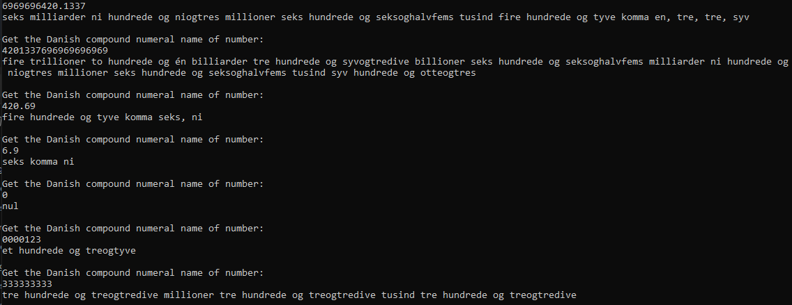

# Danish Compound Numeral Names in Rust

One of my first projects in Rust. Made as an exercise for myself.
This program takes compound `f64` numbers and returns Danish compound numeral names.

Example:

